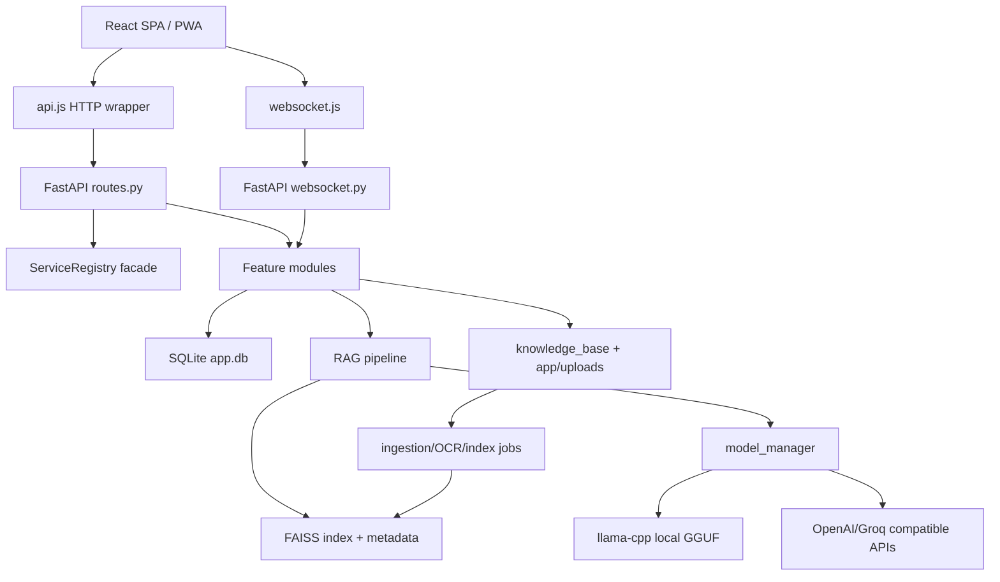
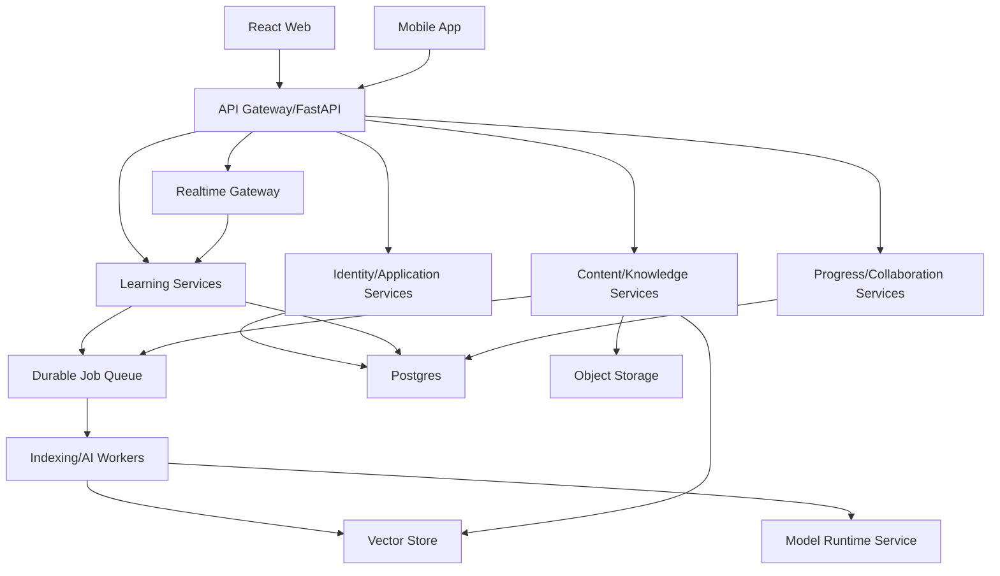

# Architecture Review

## Current Pattern

The system is a modular monolith:

- Backend: FastAPI monolith with feature modules, SQLite, FAISS, local/cloud model adapters, in-process background work.
- Frontend: React SPA with a central workspace component, local hooks/services, no external state manager/router.
- Data: local filesystem + SQLite + FAISS artifacts.
- AI layer: local GGUF models via llama-cpp with optional cloud OpenAI-compatible providers.

## Current Architecture

## Strengths

- Clear product feature breadth: chat, lessons, quizzes, flashcards, assessment, progress, subscriptions, collaboration.
- Config-driven model profiles and network settings.
- Good test-suite footprint across backend and frontend.
- Message envelope system improves frontend error consistency.
- Content reference abstraction supports both bundled KB and user uploads.
- Service port layer exists as a path toward cleaner architecture.

## Scalability Concerns

- SQLite write concurrency is the main bottleneck.
- In-process indexing jobs do not scale across multiple backend workers.
- FAISS and document globals are process-local; multi-worker deployments would diverge unless coordinated.
- Local LLM cache is RAM-heavy and per-process.
- WebSocket streaming ties client connections to the API process doing model work.
- Browser localStorage queues are not a reliable sync system for multi-device use.

## Separation of Concerns

Good:

- API, schemas, modules, frontend services/hooks are separated at a directory level.
- Config loader centralizes settings.
- Service ports define intended application seams.

Weak:

- `routes.py`, `rag.py`, `model_manager.py`, `lesson_plan.py`, `analytics.py`, `ChatPanel.jsx`, and `RoleHubPanel.jsx` are large mixed-responsibility files.
- Some routes use service facade; others call modules directly.
- Frontend state is spread across ChatPanel, hooks, localStorage, and child components.
- CSS is not component-scoped.

## Reusability

- Backend feature modules are reusable inside the monolith but often import concrete DB helpers directly.
- Frontend hooks are reusable for ChatPanel-like flows but not generic enough for a mobile/native client.
- Request/response schemas help API reuse, but response models are not consistently declared on routes.

## Performance Bottlenecks

- First local model load and embedding model load.
- FAISS indexing and OCR on large PDFs/images.
- Large React components causing expensive renders.
- Markdown rendering and giant CSS can affect chat performance.
- Polling index/reindex status rather than server push.

## Recommended Improved Architecture

## Recommended Evolution

1. Extract route groups into routers: auth, chat, knowledge, lessons, assessment, progress, commerce, collaboration, admin.
2. Complete the service-port pattern and make routes depend on services instead of direct DB/module calls.
3. Move DB migrations to Alembic or a migration runner with versioned scripts.
4. Introduce a durable queue for indexing and long AI jobs.
5. Replace SQLite with Postgres for multi-user/concurrent deployment.
6. Move FAISS/vector operations behind a repository/service interface.
7. Split `ChatPanel` and `RoleHubPanel` into route-like workspace slices with shared state context/reducer.
8. Define stable API DTOs for mobile and generated API docs.
9. Add observability: request ids, structured logs, latency metrics, job metrics, model selection traces.
