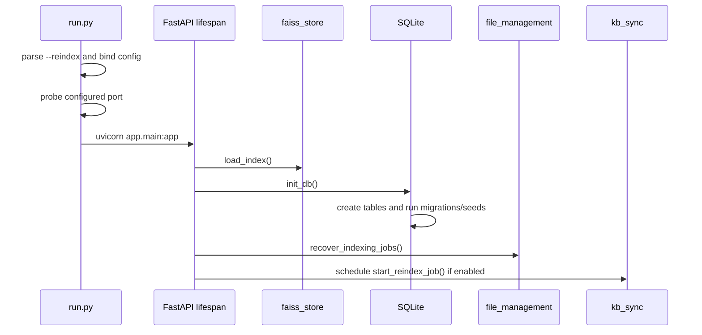
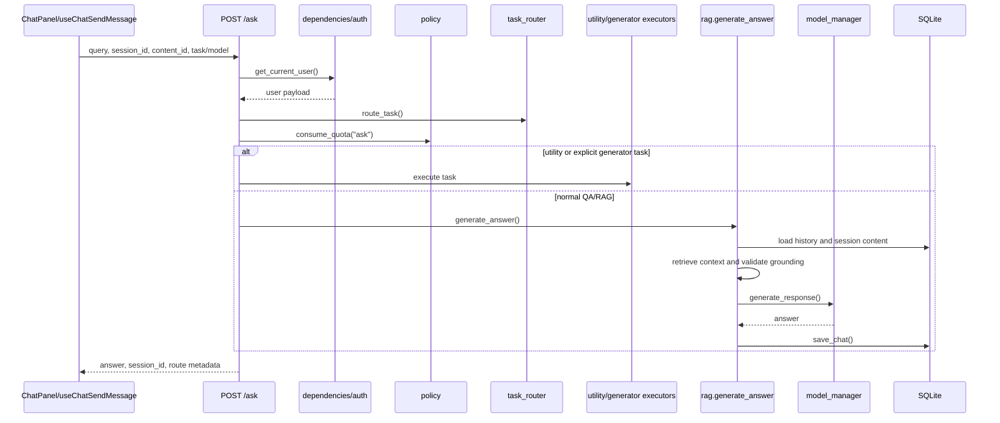
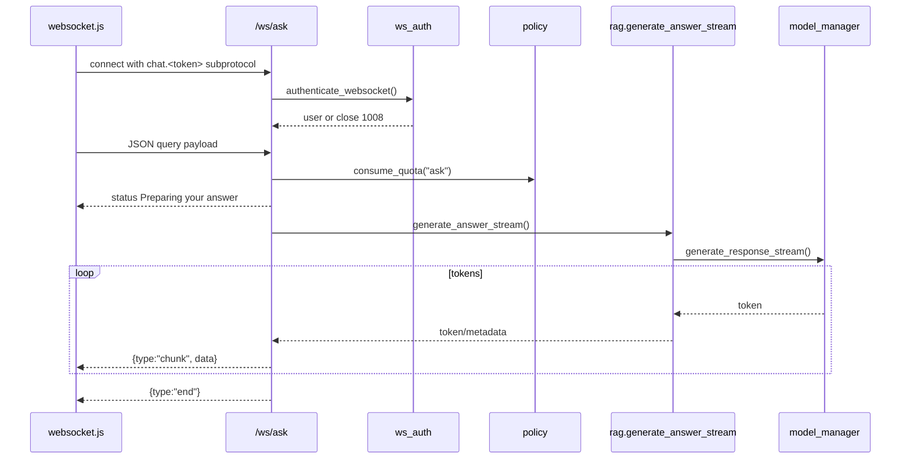
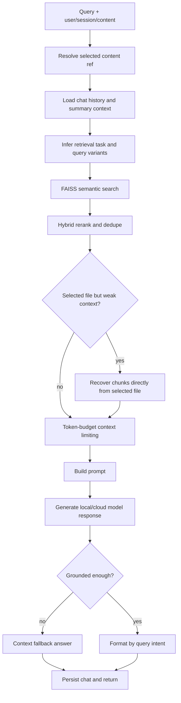
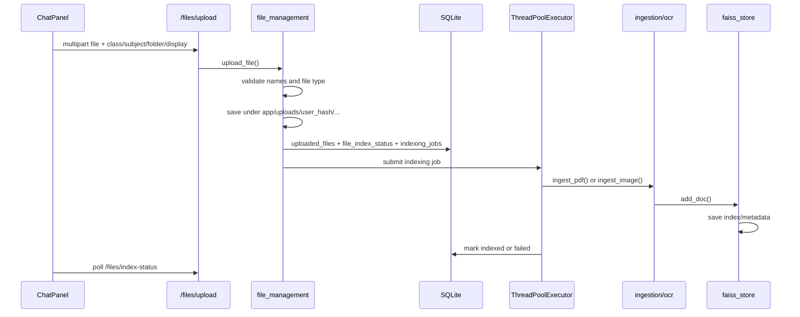
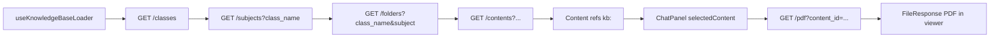
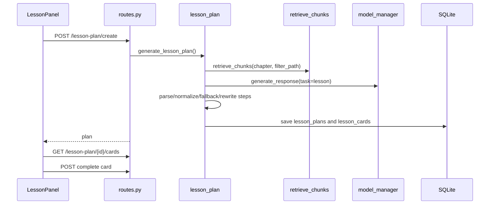
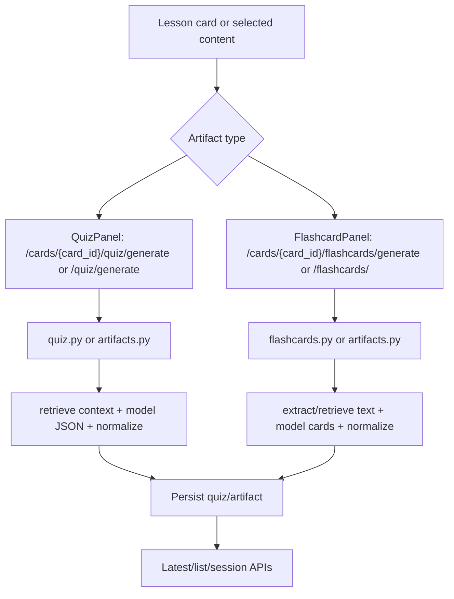
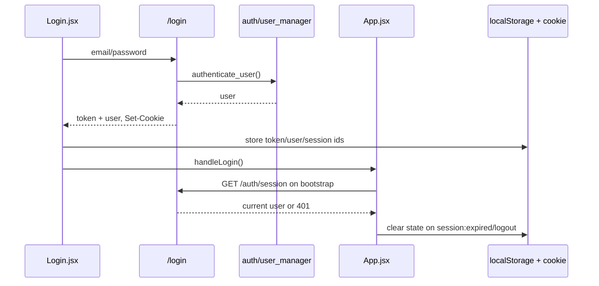

# Technical Flows

## Backend Startup

## REST Ask Flow

## WebSocket Ask Flow

## Retrieval and Grounding Pipeline

## Upload and Indexing Flow

## Knowledge Base Tree and PDF Viewer

## Lesson Plan Flow

## Quiz and Flashcard Artifact Flow

## Auth and Session Lifecycle

## Async and Background Work

- Startup KB reindex is scheduled from FastAPI lifespan as a background task/threaded job.
- Upload indexing uses an in-process `ThreadPoolExecutor` and DB-backed job rows for recovery.
- WebSocket streaming wraps synchronous generators with `asyncio.to_thread` per token.
- Offline frontend mutations queue in localStorage and replay on browser `online`.
- No external durable queue system is present.
