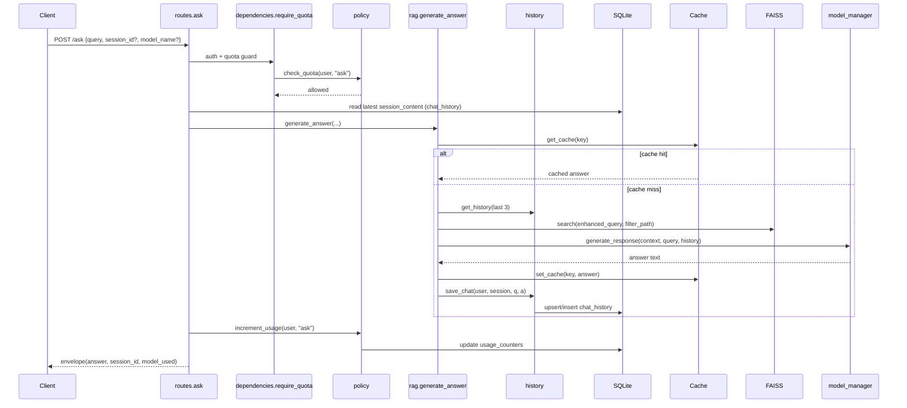
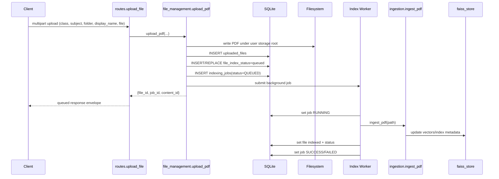
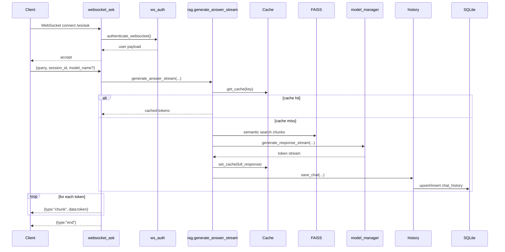
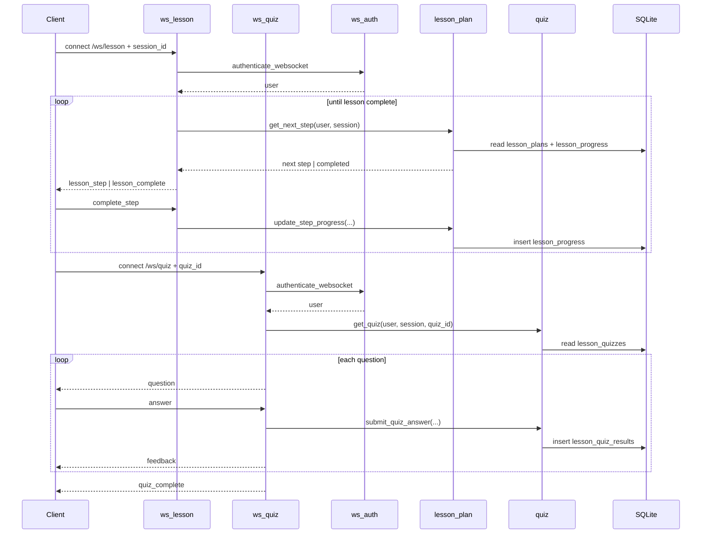
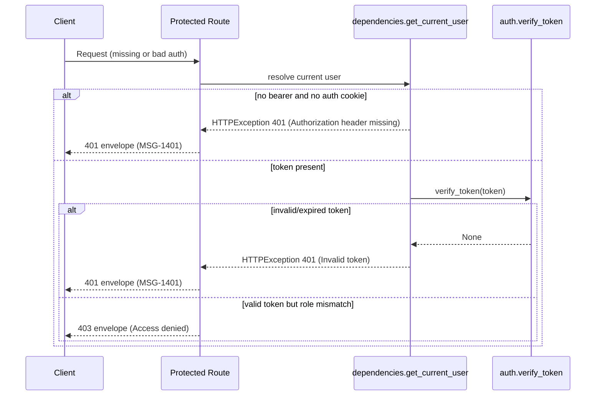
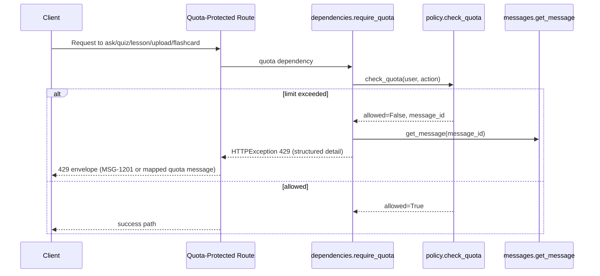
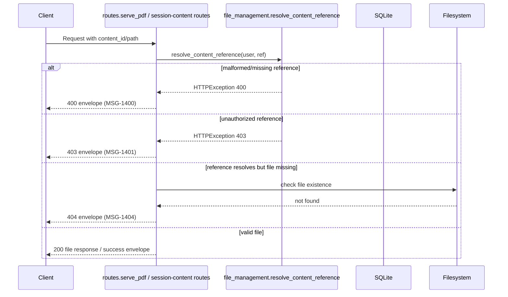
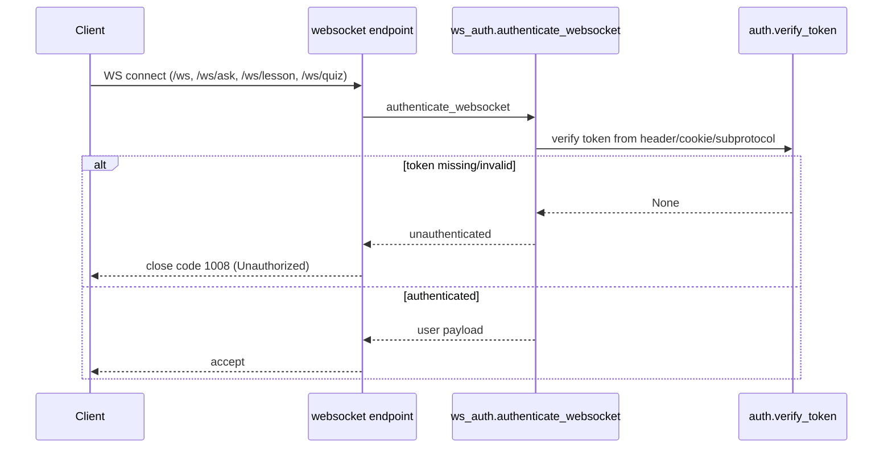
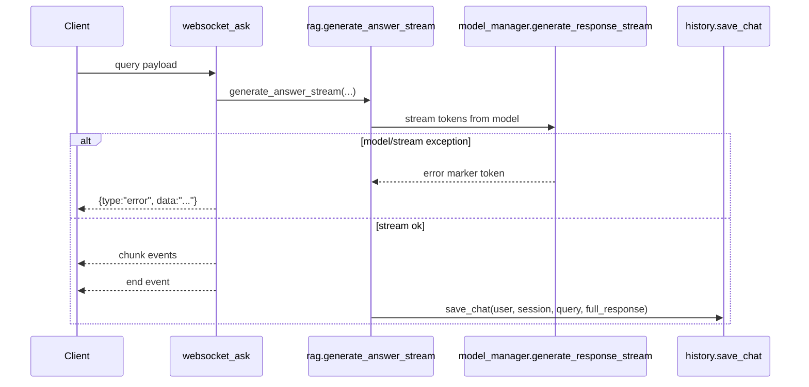
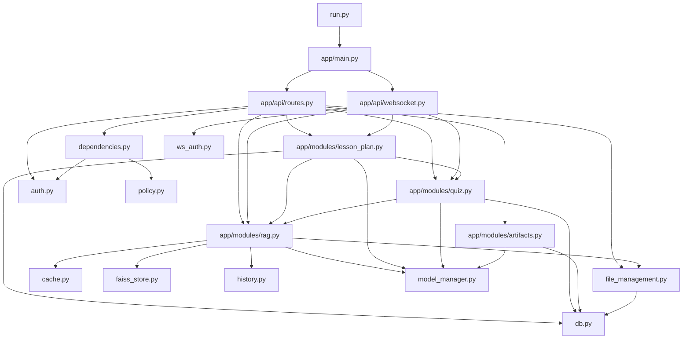

# Backend TruthMap

## Scope
This document maps backend runtime truth for the Python code under `v3/backend`:

- FastAPI entry and startup path
- HTTP route -> service/module -> DB/filesystem touchpoints
- WebSocket flow -> service/module -> persistence touchpoints
- Static Python import dependency graph for all backend `.py` files

## Entry And Startup Flow
1. `backend/run.py`
2. `uvicorn.run("app.main:app", host=..., port=...)`
3. `backend/app/main.py` creates `FastAPI(...)`
4. `lifespan()` startup executes:
   - `load_index()` (FAISS index load)
   - `load_knowledge_base()` (background KB refresh unless `SKIP_KB_REINDEX`)
   - `init_db()` (SQLite schema bootstrap)
   - `recover_indexing_jobs()` (resume queued/running file indexing jobs)
5. Router registration:
   - `app.include_router(router)` from `backend/app/api/routes.py`
   - `app.include_router(websocket_router)` from `backend/app/api/websocket.py`

## HTTP TruthMap

### Core Auth And Chat
| Method | Path | Entry Handler | Service/Module Calls | Data Touchpoints |
|---|---|---|---|---|
| POST | `/ask` | `api/routes.py::ask` | `rag.generate_answer`, `policy.increment_usage` | `chat_history` read/write (via route + `rag` + `history`), cache (Redis/in-memory), FAISS search |
| GET | `/history` | `api/routes.py::fetch_history` | `history.get_history` | `chat_history` read |
| POST | `/login` | `api/routes.py::login` | `auth.authenticate_user`, `auth.create_access_token`, `auth.set_auth_cookie` | `users` read |
| GET | `/auth/session` | `api/routes.py::get_auth_session` | `dependencies.get_current_user` | JWT decode only |
| POST | `/logout` | `api/routes.py::logout` | `auth.clear_auth_cookie` | no DB |
| POST | `/register` | `api/routes.py::register` | `user_manager.register_user` | `users` insert |
| PUT | `/profile` | `api/routes.py::update_profile` | `user_manager.update_user_profile` | `users` update, `profile_audit_log` insert |
| POST | `/reset-password` | `api/routes.py::reset_password` | `user_manager.reset_password_with_email_dob` | `users` read/update |

### Admin And Reindex
| Method | Path | Entry Handler | Service/Module Calls | Data Touchpoints |
|---|---|---|---|---|
| POST | `/admin/reindex` | `api/routes.py::reindex` | `faiss_store.load_knowledge_base(force_reindex=True)` | FAISS index files + metadata files |
| POST | `/admin/reindex-incremental` | `api/routes.py::incremental_reindex` | `faiss_store.load_knowledge_base(force_reindex=False)` | FAISS index files + metadata files |

### Sessions And Session Content
| Method | Path | Entry Handler | Service/Module Calls | Data Touchpoints |
|---|---|---|---|---|
| GET | `/sessions` | `api/routes.py::get_sessions` | direct SQL in route | `chat_history` read (session aggregates) |
| DELETE | `/sessions/{session_id}` | `api/routes.py::delete_session` | `dependencies.validate_session_ownership`, direct SQL | `chat_history` delete |
| PUT | `/sessions/{session_id}` | `api/routes.py::rename_session` | `dependencies.validate_session_ownership`, direct SQL | `chat_history` update |
| GET | `/sessions/{session_id}/content` | `api/routes.py::get_session_content` | `file_management.resolve_content_reference`, direct SQL | `chat_history` read, uploaded-file ownership validation |
| PUT | `/sessions/{session_id}/content` | `api/routes.py::set_session_content` | `file_management.resolve_content_reference`, direct SQL | `chat_history` update |

### File Management And Content Access
| Method | Path | Entry Handler | Service/Module Calls | Data Touchpoints |
|---|---|---|---|---|
| POST | `/files/upload` | `api/routes.py::upload_file` | `file_management.upload_pdf`, `policy.increment_usage` | `uploaded_files`, `file_index_status`, `indexing_jobs`; filesystem write; async ingest/FAISS update |
| GET | `/files/tree` | `api/routes.py::files_tree` | `file_management.get_files_tree` | `uploaded_files` + `file_index_status` read |
| GET | `/files/index-status` | `api/routes.py::files_index_status` | `file_management.get_index_status` | `uploaded_files` + `file_index_status` read |
| POST | `/files/reindex` | `api/routes.py::files_reindex` | `file_management.queue_reindex` | `indexing_jobs` insert/update; `uploaded_files` and `file_index_status` updates during job |
| GET | `/pdf` | `api/routes.py::serve_pdf` | `file_management.resolve_content_reference` | `uploaded_files` read + filesystem read |

### Knowledge Base Browsing
| Method | Path | Entry Handler | Service/Module Calls | Data Touchpoints |
|---|---|---|---|---|
| GET | `/classes` | `api/routes.py::get_classes` | direct filesystem listing | `knowledge_base` filesystem |
| GET | `/subjects` | `api/routes.py::get_subjects` | direct filesystem listing | `knowledge_base` filesystem |
| GET | `/folders` | `api/routes.py::get_folders` | direct filesystem listing | `knowledge_base` filesystem |
| GET | `/contents` | `api/routes.py::get_contents` | `file_management.make_kb_content_ref` + fs listing | `knowledge_base` filesystem |

### Lesson Plan
| Method | Path | Entry Handler | Service/Module Calls | Data Touchpoints |
|---|---|---|---|---|
| POST | `/lesson-plan/create` | `api/routes.py::create_plan` | `lesson_plan.generate_lesson_plan`, `policy.increment_usage` | `lesson_plans` insert, `lesson_cards` insert, RAG retrieval/LLM |
| GET | `/lesson-plan/sessions` | `api/routes.py::get_lesson_sessions` | `lesson_plan.list_lesson_sessions` | `lesson_plans` read |
| PUT | `/lesson-plan/sessions/{session_id}` | `api/routes.py::rename_lesson_plan_session` | `lesson_plan.rename_lesson_session` | `lesson_plans` update (`plan_json`) |
| DELETE | `/lesson-plan/sessions/{session_id}` | `api/routes.py::remove_lesson_plan_session` | `lesson_plan.delete_lesson_session` | cascading deletes in `lesson_plans`, `lesson_cards`, `lesson_card_progress`, `lesson_progress`, `lesson_quizzes`, `lesson_quiz_results`, `learning_artifacts` |
| GET | `/lesson-plan` | `api/routes.py::fetch_plan` | `lesson_plan.get_lesson_plan` | `lesson_plans` read |
| POST | `/lesson-plan/progress` | `api/routes.py::update_progress` | `lesson_plan.update_step_progress` | `lesson_progress` insert |
| GET | `/lesson-plan/next` | `api/routes.py::next_step` | `lesson_plan.get_next_step` | `lesson_plans` + `lesson_progress` read |
| GET | `/lesson-plan/{lesson_plan_id}/cards` | `api/routes.py::lesson_cards` | `lesson_plan.get_lesson_plan_cards` | `lesson_plans`, `lesson_cards`, `lesson_card_progress` read |
| POST | `/lesson-plan/{lesson_plan_id}/cards/{card_id}/complete` | `api/routes.py::complete_card` | `lesson_plan.complete_lesson_card` | `lesson_card_progress` upsert |

### Quiz And Artifacts
| Method | Path | Entry Handler | Service/Module Calls | Data Touchpoints |
|---|---|---|---|---|
| POST | `/quiz/generate` | `api/routes.py::api_generate_quiz` | `quiz.generate_quiz`, `policy.increment_usage` | `lesson_quizzes` insert; RAG retrieval/LLM |
| GET | `/quiz/sessions` | `api/routes.py::api_list_quiz_sessions` | `quiz.list_quiz_sessions` | `lesson_quizzes` read (+ chapter lookup from `lesson_plans`) |
| PUT | `/quiz/sessions/{session_id}` | `api/routes.py::rename_quiz_session_endpoint` | `quiz.rename_quiz_session` | `lesson_quizzes` update (`quiz_json`) |
| DELETE | `/quiz/sessions/{session_id}` | `api/routes.py::delete_quiz_session_endpoint` | `quiz.delete_quiz_session` | `lesson_quizzes` + `lesson_quiz_results` delete |
| GET | `/quiz/latest` | `api/routes.py::api_get_latest_quiz` | `quiz.get_latest_quiz_for_session` | `lesson_quizzes` read |
| GET | `/quiz/{quiz_id}` | `api/routes.py::api_get_quiz` | `quiz.get_quiz` | `lesson_quizzes` read |
| POST | `/quiz/{quiz_id}/submit` | `api/routes.py::api_submit_quiz` | `quiz.submit_quiz_answer` | `lesson_quizzes` read, `lesson_quiz_results` insert |
| POST | `/cards/{card_id}/quiz/generate` | `api/routes.py::generate_card_quiz_endpoint` | `lesson_plan.get_card_for_user`, `artifacts.generate_card_quiz`, `policy.increment_usage` | `lesson_cards`/`lesson_plans` read, `learning_artifacts` insert |
| POST | `/cards/{card_id}/flashcards/generate` | `api/routes.py::generate_card_flashcards_endpoint` | `lesson_plan.get_card_for_user`, `artifacts.generate_card_flashcards`, `policy.increment_usage` | `lesson_cards`/`lesson_plans` read, `learning_artifacts` insert |
| GET | `/artifacts/{artifact_id}` | `api/routes.py::get_artifact_endpoint` | `artifacts.get_artifact` | `learning_artifacts` read |
| POST | `/artifacts/{artifact_id}/save` | `api/routes.py::save_artifact_endpoint` | `artifacts.update_artifact_meta` | `learning_artifacts` update |
| GET | `/flashcards/sessions` | `api/routes.py::api_list_flashcard_sessions` | `artifacts.list_flashcard_sessions` | `learning_artifacts` read (+ chapter lookup from `lesson_plans`) |
| GET | `/flashcards/latest` | `api/routes.py::api_get_latest_flashcards` | `artifacts.get_latest_flashcard_artifact_for_session` | `learning_artifacts` read |
| PUT | `/flashcards/sessions/{session_id}` | `api/routes.py::rename_flashcard_session_endpoint` | `artifacts.rename_flashcard_session` | `learning_artifacts` update (`payload_json`) |
| DELETE | `/flashcards/sessions/{session_id}` | `api/routes.py::delete_flashcard_session_endpoint` | `artifacts.delete_flashcard_session` | `learning_artifacts` delete |

### Plan Usage APIs
| Method | Path | Entry Handler | Service/Module Calls | Data Touchpoints |
|---|---|---|---|---|
| GET | `/plan/me` | `api/routes.py::get_my_plan` | `policy.get_user_plan`, `policy.get_usage_snapshot` | `users` read, `usage_counters` read/update on expiry handling |
| GET | `/plan/limits` | `api/routes.py::get_plan_limits` | `policy.get_user_plan` | `users` read/update on expiry handling |

### Included Router: Flashcards
`api/routes.py` includes `modules/flashcards.py` router with prefix `/flashcards`.

| Method | Path | Entry Handler | Service/Module Calls | Data Touchpoints |
|---|---|---|---|---|
| POST | `/flashcards/` | `modules/flashcards.py::generate_flashcards` | `resolve_files`, `extract_text_from_files`, `generate_flashcards_from_text`, `policy.increment_usage` | `knowledge_base` filesystem read, optional `flashcards` table insert |

## WebSocket TruthMap
| WS Path | Entry Handler | Auth Path | Service/Module Calls | Data Touchpoints |
|---|---|---|---|---|
| `/ws` | `api/websocket.py::websocket_endpoint` | `ws_auth.authenticate_websocket` | `rag.generate_answer` | `chat_history` read/write via RAG + history; cache + FAISS |
| `/ws/ask` | `api/websocket.py::websocket_ask` | `ws_auth.authenticate_websocket` | `rag.generate_answer_stream`, `history.save_chat` | `chat_history` read/write; cache + FAISS |
| `/ws/lesson` | `api/websocket.py::ws_lesson` | `ws_auth.authenticate_websocket` | `lesson_plan.get_next_step`, `lesson_plan.update_step_progress` | `lesson_plans` read, `lesson_progress` insert |
| `/ws/quiz` | `api/websocket.py::ws_quiz` | `ws_auth.authenticate_websocket` | `quiz.get_quiz`, `quiz.submit_quiz_answer` | `lesson_quizzes` read, `lesson_quiz_results` insert |

## Sequence Diagrams

### HTTP: Ask Flow (`POST /ask`)


### HTTP: File Upload + Async Index (`POST /files/upload`)


### WebSocket: Ask Streaming (`/ws/ask`)


### WebSocket: Lesson + Quiz Interactive Loops


## Failure-Path Diagrams

### HTTP Auth Failures (`401`/`403`)


### HTTP Quota Failures (`429`)


### Session Content Access Failures (`400`/`403`/`404`)


### WebSocket Handshake/Auth Failures (`WS 1008`)


### WebSocket Runtime Stream Failures


## Error Mapping Matrix
| Surface | Condition | Status / Code | Origin |
|---|---|---|---|
| HTTP | Missing auth token | `401` | `dependencies.get_current_user` |
| HTTP | Invalid/expired token | `401` | `auth.verify_token` -> `dependencies.get_current_user` |
| HTTP | Role mismatch | `403` | `dependencies.require_role` |
| HTTP | Session ownership failure | `403` | `dependencies.validate_session_ownership` |
| HTTP | Session not found during ownership validation | `404` | `dependencies.validate_session_ownership` |
| HTTP | Quota exceeded | `429` | `dependencies.require_quota` + `policy.check_quota` |
| HTTP | Invalid request payload/path | `400` / `422` | route validation + FastAPI validation handler |
| HTTP | Unhandled server exception | `500` | global exception handler in `main.py` |
| WS | Unauthorized connect | close `1008` | `ws_auth.authenticate_websocket` paths |
| WS | Streaming/runtime failure | JSON `type:error` | websocket handlers (`websocket.py`) |

## DB Table Ownership (Operational)
Primary table ownership by module (not strict DDD, but runtime reality):

| Table | Primary Writers/Readers |
|---|---|
| `users` | `user_manager.py`, `auth.py`, `policy.py` |
| `chat_history` | `history.py`, `rag.py`, `api/routes.py`, `dependencies.py` |
| `lesson_plans` | `lesson_plan.py` |
| `lesson_cards` | `lesson_plan.py` |
| `lesson_card_progress` | `lesson_plan.py` |
| `lesson_progress` | `lesson_plan.py` |
| `lesson_quizzes` | `quiz.py` |
| `lesson_quiz_results` | `quiz.py` |
| `learning_artifacts` | `artifacts.py`, `lesson_plan.py` (delete cascade path) |
| `uploaded_files` | `file_management.py` |
| `file_index_status` | `file_management.py` |
| `indexing_jobs` | `file_management.py` |
| `usage_counters` | `policy.py` |
| `message_catalog` | `messages.py`, `db.py` bootstrap |
| `profile_audit_log` | `user_manager.py` |

## Static Dependency Graph (All Backend Python Files)
Graph source: AST parse of imports in every `v3/backend/**/*.py` file (excluding `__pycache__`).

### High-Level Graph (Mermaid)


### Full Adjacency List (All Python Files)
```json
{
  "run.py": [
    "app/core/config_loader.py"
  ],
  "app/main.py": [
    "app/api/routes.py",
    "app/api/websocket.py",
    "app/core/config_loader.py",
    "app/core/debug_logger.py",
    "app/modules/db.py",
    "app/modules/faiss_store.py",
    "app/modules/file_management.py",
    "app/modules/messages.py"
  ],
  "app/__init__.py": [],
  "migrations/run_migration.py": [],
  "app/api/routes.py": [
    "app/modules/artifacts.py",
    "app/modules/auth.py",
    "app/modules/db.py",
    "app/modules/dependencies.py",
    "app/modules/faiss_store.py",
    "app/modules/file_management.py",
    "app/modules/flashcards.py",
    "app/modules/history.py",
    "app/modules/lesson_plan.py",
    "app/modules/messages.py",
    "app/modules/policy.py",
    "app/modules/quiz.py",
    "app/modules/rag.py",
    "app/modules/user_manager.py",
    "app/schemas/request.py",
    "app/schemas/response.py"
  ],
  "app/api/websocket.py": [
    "app/core/debug_logger.py",
    "app/modules/history.py",
    "app/modules/lesson_plan.py",
    "app/modules/quiz.py",
    "app/modules/rag.py",
    "app/modules/ws_auth.py"
  ],
  "app/api/__init__.py": [],
  "app/core/config_loader.py": [],
  "app/core/debug_logger.py": [],
  "app/core/security.py": [
    "app/modules/auth.py"
  ],
  "app/core/__init__.py": [],
  "app/modules/artifacts.py": [
    "app/modules/db.py",
    "app/modules/model_manager.py"
  ],
  "app/modules/auth.py": [
    "app/core/debug_logger.py",
    "app/modules/db.py",
    "app/modules/user_manager.py"
  ],
  "app/modules/cache.py": [
    "app/core/config_loader.py",
    "app/core/debug_logger.py"
  ],
  "app/modules/db.py": [
    "app/modules/user_manager.py"
  ],
  "app/modules/dependencies.py": [
    "app/core/debug_logger.py",
    "app/modules/auth.py",
    "app/modules/db.py",
    "app/modules/messages.py",
    "app/modules/policy.py"
  ],
  "app/modules/faiss_store.py": [
    "app/modules/ingestion.py"
  ],
  "app/modules/file_management.py": [
    "app/modules/db.py",
    "app/modules/ingestion.py"
  ],
  "app/modules/flashcards.py": [
    "app/modules/db.py",
    "app/modules/dependencies.py",
    "app/modules/ingestion.py",
    "app/modules/model_manager.py",
    "app/modules/policy.py"
  ],
  "app/modules/history.py": [
    "app/modules/db.py"
  ],
  "app/modules/ingestion.py": [
    "app/modules/faiss_store.py",
    "app/modules/model_manager.py"
  ],
  "app/modules/lesson_plan.py": [
    "app/modules/db.py",
    "app/modules/model_manager.py",
    "app/modules/quiz.py",
    "app/modules/rag.py"
  ],
  "app/modules/messages.py": [
    "app/modules/db.py"
  ],
  "app/modules/model_manager.py": [
    "app/core/config_loader.py",
    "app/core/debug_logger.py"
  ],
  "app/modules/policy.py": [
    "app/modules/db.py"
  ],
  "app/modules/progress.py": [
    "app/modules/db.py"
  ],
  "app/modules/quiz.py": [
    "app/modules/db.py",
    "app/modules/model_manager.py",
    "app/modules/rag.py"
  ],
  "app/modules/rag.py": [
    "app/core/config_loader.py",
    "app/core/debug_logger.py",
    "app/modules/cache.py",
    "app/modules/db.py",
    "app/modules/faiss_store.py",
    "app/modules/file_management.py",
    "app/modules/history.py",
    "app/modules/model_manager.py"
  ],
  "app/modules/translation.py": [],
  "app/modules/user_manager.py": [],
  "app/modules/ws_auth.py": [
    "app/modules/auth.py"
  ],
  "app/modules/__init__.py": [],
  "app/schemas/request.py": [],
  "app/schemas/response.py": [],
  "app/schemas/__init__.py": []
}
```

## Notes And Caveats
- Several endpoints do direct SQL in `api/routes.py` in addition to service-level SQL.
- Quiz and artifact session titles are stored in JSON payload blobs (`quiz_json`, `payload_json`) rather than separate normalized columns.
- File indexing is asynchronous: API returns queued job metadata while DB/FAISS updates continue in background worker threads.
- `progress.py` exists but lesson progress APIs currently use `lesson_plan.py` implementations.