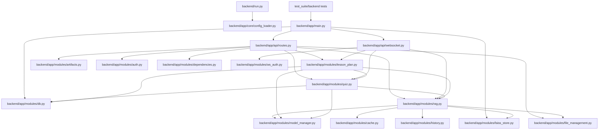
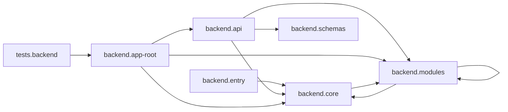
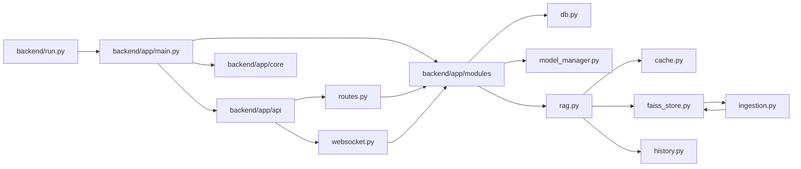

# v3 Python Static Dependency Graph

## Scope
This document maps static import dependencies between Python files across the v3 codebase.

Coverage includes:
- backend runtime code under backend/app and backend/migrations
- backend test code under test_suite/backend
- backend launcher backend/run.py

Exclusions:
- __pycache__ directories
- non-Python files

## Method
The graph is generated by parsing Python AST import nodes from all .py files and resolving:
- absolute imports
- relative imports
- app.* aliasing to backend/app/* for runtime/test import compatibility

Each edge means: source file imports target file (directly or via from ... import ...).

## Summary
- Total Python files scanned: 49
- Graph nodes (Python files): 49
- Directed import edges: 79
- Detected cycles: 1

Detected cycle:
- backend/app/modules/faiss_store.py -> backend/app/modules/ingestion.py -> backend/app/modules/faiss_store.py

## High-Level Graph


## Layered Dependency View

Layer membership (file counts):
- backend.entry: 1
- backend.api: 3
- backend.core: 4
- backend.modules: 21
- backend.schemas: 3
- backend.migrations: 1
- backend.app-root (main + package init): 2
- tests.backend: 14



Cross-layer edge counts (static imports):

| From Layer | To Layer | Edge Count |
|---|---|---:|
| backend.api | backend.core | 1 |
| backend.api | backend.modules | 19 |
| backend.api | backend.schemas | 2 |
| backend.core | backend.modules | 1 |
| backend.entry | backend.core | 1 |
| backend.modules | backend.core | 8 |
| backend.modules | backend.modules | 37 |
| backend.app-root | backend.api | 2 |
| backend.app-root | backend.core | 2 |
| backend.app-root | backend.modules | 4 |
| tests.backend | backend.app-root | 2 |

Layer membership notes:
- backend.app-root includes `backend/app/main.py` and `backend/app/__init__.py`.
- tests currently touch runtime mostly through `backend/app/main.py` imports in envelope/e2e tests.

## Dependency Hotspots
Top files by inbound dependencies (most imported):
1. backend/app/modules/db.py (14)
2. backend/app/core/debug_logger.py (7)
3. backend/app/modules/model_manager.py (6)
4. backend/app/core/config_loader.py (5)
5. backend/app/modules/auth.py (4)

Top files by outbound dependencies (import most others):
1. backend/app/api/routes.py (16)
2. backend/app/main.py (8)
3. backend/app/modules/rag.py (8)
4. backend/app/api/websocket.py (6)
5. backend/app/modules/dependencies.py (5)

## Full File-to-File Adjacency List
```json
{
  "backend/run.py": [
    "backend/app/core/config_loader.py"
  ],
  "test_suite/backend/conftest.py": [],
  "test_suite/backend/test_auth.py": [],
  "test_suite/backend/test_cache.py": [],
  "test_suite/backend/test_contract_envelope.py": [
    "backend/app/main.py"
  ],
  "test_suite/backend/test_e2e.py": [
    "backend/app/main.py"
  ],
  "test_suite/backend/test_file_management.py": [],
  "test_suite/backend/test_lesson_plan.py": [],
  "test_suite/backend/test_low_coverage_modules.py": [],
  "test_suite/backend/test_migration_scripts.py": [],
  "test_suite/backend/test_rag.py": [],
  "test_suite/backend/test_schemas.py": [],
  "test_suite/backend/test_session_security.py": [],
  "test_suite/backend/test_websocket.py": [],
  "test_suite/backend/test_websocket_routes.py": [],
  "backend/app/main.py": [
    "backend/app/api/routes.py",
    "backend/app/api/websocket.py",
    "backend/app/core/config_loader.py",
    "backend/app/core/debug_logger.py",
    "backend/app/modules/db.py",
    "backend/app/modules/faiss_store.py",
    "backend/app/modules/file_management.py",
    "backend/app/modules/messages.py"
  ],
  "backend/app/__init__.py": [],
  "backend/migrations/run_migration.py": [],
  "backend/app/api/routes.py": [
    "backend/app/modules/artifacts.py",
    "backend/app/modules/auth.py",
    "backend/app/modules/db.py",
    "backend/app/modules/dependencies.py",
    "backend/app/modules/faiss_store.py",
    "backend/app/modules/file_management.py",
    "backend/app/modules/flashcards.py",
    "backend/app/modules/history.py",
    "backend/app/modules/lesson_plan.py",
    "backend/app/modules/messages.py",
    "backend/app/modules/policy.py",
    "backend/app/modules/quiz.py",
    "backend/app/modules/rag.py",
    "backend/app/modules/user_manager.py",
    "backend/app/schemas/request.py",
    "backend/app/schemas/response.py"
  ],
  "backend/app/api/websocket.py": [
    "backend/app/core/debug_logger.py",
    "backend/app/modules/history.py",
    "backend/app/modules/lesson_plan.py",
    "backend/app/modules/quiz.py",
    "backend/app/modules/rag.py",
    "backend/app/modules/ws_auth.py"
  ],
  "backend/app/api/__init__.py": [],
  "backend/app/core/config_loader.py": [],
  "backend/app/core/debug_logger.py": [],
  "backend/app/core/security.py": [
    "backend/app/modules/auth.py"
  ],
  "backend/app/core/__init__.py": [],
  "backend/app/modules/artifacts.py": [
    "backend/app/modules/db.py",
    "backend/app/modules/model_manager.py"
  ],
  "backend/app/modules/auth.py": [
    "backend/app/core/debug_logger.py",
    "backend/app/modules/db.py",
    "backend/app/modules/user_manager.py"
  ],
  "backend/app/modules/cache.py": [
    "backend/app/core/config_loader.py",
    "backend/app/core/debug_logger.py"
  ],
  "backend/app/modules/db.py": [
    "backend/app/modules/user_manager.py"
  ],
  "backend/app/modules/dependencies.py": [
    "backend/app/core/debug_logger.py",
    "backend/app/modules/auth.py",
    "backend/app/modules/db.py",
    "backend/app/modules/messages.py",
    "backend/app/modules/policy.py"
  ],
  "backend/app/modules/faiss_store.py": [
    "backend/app/modules/ingestion.py"
  ],
  "backend/app/modules/file_management.py": [
    "backend/app/modules/db.py",
    "backend/app/modules/ingestion.py"
  ],
  "backend/app/modules/flashcards.py": [
    "backend/app/modules/db.py",
    "backend/app/modules/dependencies.py",
    "backend/app/modules/ingestion.py",
    "backend/app/modules/model_manager.py",
    "backend/app/modules/policy.py"
  ],
  "backend/app/modules/history.py": [
    "backend/app/modules/db.py"
  ],
  "backend/app/modules/ingestion.py": [
    "backend/app/modules/faiss_store.py",
    "backend/app/modules/model_manager.py"
  ],
  "backend/app/modules/lesson_plan.py": [
    "backend/app/modules/db.py",
    "backend/app/modules/model_manager.py",
    "backend/app/modules/quiz.py",
    "backend/app/modules/rag.py"
  ],
  "backend/app/modules/messages.py": [
    "backend/app/modules/db.py"
  ],
  "backend/app/modules/model_manager.py": [
    "backend/app/core/config_loader.py",
    "backend/app/core/debug_logger.py"
  ],
  "backend/app/modules/policy.py": [
    "backend/app/modules/db.py"
  ],
  "backend/app/modules/progress.py": [
    "backend/app/modules/db.py"
  ],
  "backend/app/modules/quiz.py": [
    "backend/app/modules/db.py",
    "backend/app/modules/model_manager.py",
    "backend/app/modules/rag.py"
  ],
  "backend/app/modules/rag.py": [
    "backend/app/core/config_loader.py",
    "backend/app/core/debug_logger.py",
    "backend/app/modules/cache.py",
    "backend/app/modules/db.py",
    "backend/app/modules/faiss_store.py",
    "backend/app/modules/file_management.py",
    "backend/app/modules/history.py",
    "backend/app/modules/model_manager.py"
  ],
  "backend/app/modules/translation.py": [],
  "backend/app/modules/user_manager.py": [],
  "backend/app/modules/ws_auth.py": [
    "backend/app/modules/auth.py"
  ],
  "backend/app/modules/__init__.py": [],
  "backend/app/schemas/request.py": [],
  "backend/app/schemas/response.py": [],
  "backend/app/schemas/__init__.py": []
}
```

## Review Notes
- Most backend modules converge on backend/app/modules/db.py, making DB module a critical dependency hotspot.
- The API boundary is centralized in backend/app/api/routes.py with high fan-out to service modules.
- One import cycle exists between ingestion and FAISS store modules.
  - This is manageable but worth monitoring because it can complicate refactors and startup behavior.
- Most test files are intentionally low-coupled; only envelope/e2e tests import backend/app/main.py directly.

## Backend-Only View (No Tests)

This variant excludes all test files and focuses only on runtime backend code.

Backend-only summary:
- Python files: 35
- Directed edges: 77
- Cycles: 1

Detected backend cycle:
- backend/app/modules/faiss_store.py -> backend/app/modules/ingestion.py -> backend/app/modules/faiss_store.py

### Presentation Mermaid (Backend Only)


### Backend-Only Hotspots
Top inbound dependencies:
1. backend/app/modules/db.py (14)
2. backend/app/core/debug_logger.py (7)
3. backend/app/modules/model_manager.py (6)
4. backend/app/core/config_loader.py (5)
5. backend/app/modules/auth.py (4)

Top outbound dependencies:
1. backend/app/api/routes.py (16)
2. backend/app/main.py (8)
3. backend/app/modules/rag.py (8)
4. backend/app/api/websocket.py (6)
5. backend/app/modules/dependencies.py (5)
