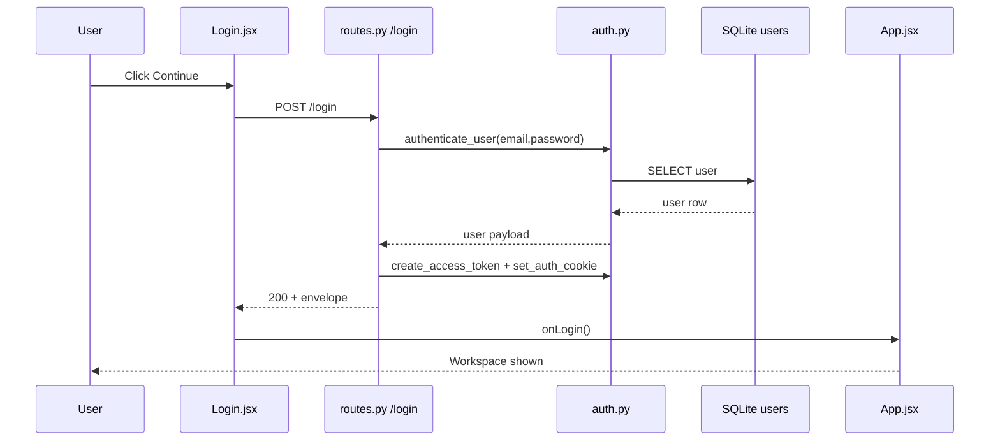
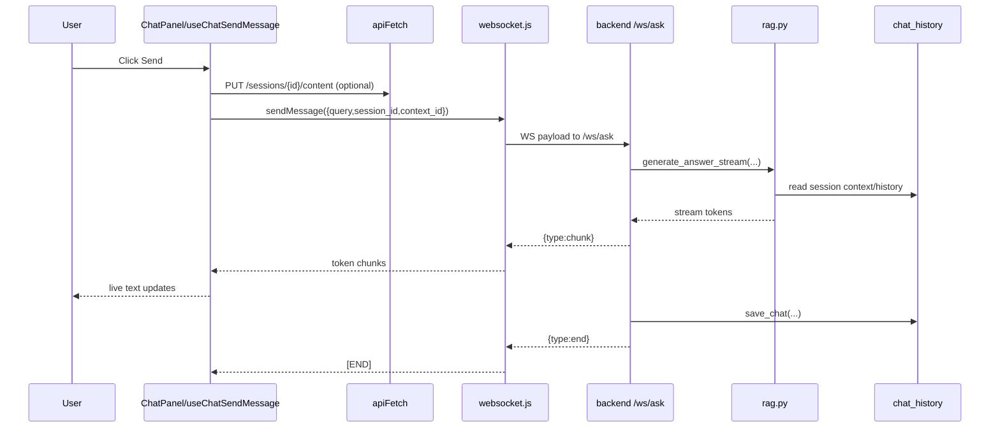

# Runtime Flow View (React Click -> Runtime Execution)

## Purpose
This guide explains what actually runs when a user clicks key buttons in the React app.
It traces the real runtime chain:

UI Click -> React Handler -> Frontend Service -> Backend Route/WS -> Module Logic -> Data Side Effects

## Core Runtime Building Blocks
- Frontend entry: `frontend/src/App.jsx`
- Main workspace: `frontend/src/components/ChatPanel.jsx`
- API wrapper: `frontend/src/services/api.js`
- WebSocket wrapper: `frontend/src/services/websocket.js`
- Backend HTTP routes: `backend/app/api/routes.py`
- Backend WS routes: `backend/app/api/websocket.py`

## Single-Click Trace Index
| UI Action | Frontend Start | Transport | Backend Entry | Common Failure Path | Jump |
|---|---|---|---|---|---|
| Continue (Login) | `Login.jsx::handleLogin` | HTTP `POST /login` | `routes.py::login` | `401` invalid credentials | [Login Flow](#1-login-flow-continue-button) |
| Send (Chat) | `useChatSendMessage::handleSend` | WS `/ws/ask` (+ optional `PUT /sessions/{id}/content`) | `websocket.py::websocket_ask` | WS close `1008` -> session expired; stream emits `type:error` on runtime failure | [Chat Send Flow](#2-chat-send-flow-send-button) |
| Upload PDF | `ChatPanel.jsx::handleUploadFile` | HTTP `POST /files/upload` | `routes.py::upload_file` | `400` invalid file/path, `429` quota exceeded | [Upload PDF Flow](#3-upload-pdf-flow-upload-pdf-button) |
| New Lesson Plan | `LessonPanel.jsx::handleGeneratePlan` | HTTP `POST /lesson-plan/create` | `routes.py::create_plan` | `400/422` invalid payload, `429` quota exceeded | [New Lesson Plan Flow](#4-new-lesson-plan-flow-new-lesson-plan-button) |
| Complete Lesson Card | `LessonPanel.jsx::handleCompleteCard` | HTTP `POST /lesson-plan/{plan_id}/cards/{card_id}/complete` | `routes.py::complete_card` | `404` card not found | [Complete Lesson Card Flow](#5-complete-lesson-card-flow-complete-button) |
| New Quiz | `QuizPanel.jsx::handleGenerateQuiz` | HTTP `POST /quiz/generate` or `POST /cards/{card_id}/quiz/generate` | `routes.py::api_generate_quiz` / `routes.py::generate_card_quiz_endpoint` | `404` card not found (card mode), `429` quota exceeded | [Quiz Generate Flow](#6-quiz-generate-flow-new-quiz-button) |
| Submit Answers | `QuizPanel.jsx::handleSubmitQuiz` | HTTP `POST /quiz/{quiz_id}/submit` | `routes.py::api_submit_quiz` | Empty/invalid quiz/session returns no grading results | [Quiz Submit Flow](#7-quiz-submit-flow-submit-answers-button) |
| New Flashcards | `FlashcardPanel.jsx::handleGenerateFlashcards` | HTTP `POST /flashcards/` or `POST /cards/{card_id}/flashcards/generate` | `flashcards.py::generate_flashcards` / `routes.py::generate_card_flashcards_endpoint` | `404` source content/card not found, `429` quota exceeded | [Flashcards Generate Flow](#8-flashcards-generate-flow-new-flashcards-button) |
| Save Artifact | `FlashcardPanel.jsx::handleSaveArtifact` / `LessonPanel.jsx::handleSaveArtifactMeta` | HTTP `POST /artifacts/{artifact_id}/save` | `routes.py::save_artifact_endpoint` | `404` artifact not found | [Save Artifact Metadata Flow](#9-save-artifact-metadata-flow-save-artifact-button) |
| Session Rename/Delete | `ChatPanel` and `useScopedSessionActions` | HTTP `PUT/DELETE` on session endpoints | `routes.py` session handlers | `401` expired auth, `403` ownership mismatch, `404` missing session | [Session Management Flows](#10-session-management-flows-sidebar-actions) |

---

## 1) Login Flow (Continue button)

### Click Source
- `frontend/src/components/Login.jsx` -> `handleLogin()`

### Runtime Chain
1. User clicks Continue.
2. `handleLogin()` sends `POST /login` via `fetch`.
3. Backend route `routes.login` validates credentials with `auth.authenticate_user`.
4. Backend creates JWT and sets auth cookie via `set_auth_cookie`.
5. Frontend stores `username`/`role` in localStorage and calls `onLogin()`.
6. `App.jsx` renders `ChatPanel` after `isLoggedIn=true`.

### Backend side effects
- Reads `users` table for credential verification.
- Sets HTTP-only auth cookie.



---

## 2) Chat Send Flow (Send button)

### Click Source
- `frontend/src/components/ChatPanel.jsx` -> `handleSend` from `useChatSendMessage`
- Hook: `frontend/src/hooks/useChatSendMessage.js`

### Runtime Chain
1. User clicks Send.
2. Hook appends user message to UI state and marks stream active.
3. If file context selected, hook persists it using `PUT /sessions/{id}/content`.
4. Hook sends payload through WebSocket `sendMessage(...)`.
5. WS endpoint `/ws/ask` receives query, authenticates token, streams tokens back.
6. Frontend consumes chunk tokens and renders live stream.
7. On stream end, frontend commits AI message and refreshes session list.

### Backend side effects
- Reads latest session context from `chat_history`.
- RAG pipeline: cache lookup, FAISS retrieval, model generation.
- Saves final chat via `history.save_chat` into `chat_history`.
- Increments ask usage via `policy.increment_usage` on HTTP `/ask` path (non-WS path).



---

## 3) Upload PDF Flow (Upload PDF button)

### Click Source
- `frontend/src/components/ChatPanel.jsx` -> hidden input + `handleUploadFile()`

### Runtime Chain
1. User clicks Upload PDF (opens file picker).
2. `handleUploadFile()` validates class/subject/folder and file type.
3. Sends multipart `POST /files/upload`.
4. Backend stores file metadata and queues indexing job.
5. Frontend reloads content list with `loadContents(...)`.

### Backend side effects
- Writes PDF file to storage path.
- Inserts into `uploaded_files`.
- Inserts/updates `file_index_status`.
- Creates `indexing_jobs`; background worker ingests PDF into index.

---

## 4) New Lesson Plan Flow (New Lesson Plan button)

### Click Source
- `frontend/src/components/LessonPanel.jsx` -> `handleGeneratePlan()`

### Runtime Chain
1. User clicks New Lesson Plan.
2. `runGeneratePlan({reuseSession:false})` creates/sets lesson session id.
3. Sends `POST /lesson-plan/create` with `session_id`, `chapter`, optional `lesson_context`.
4. Backend generates plan + cards, stores in DB.
5. Frontend stores returned plan, then calls `GET /lesson-plan/{id}/cards`.
6. Sidebar session list refreshes via `onLessonSessionsChange()`.

### Backend side effects
- `lesson_plans` insert.
- `lesson_cards` insert.
- Retrieval/model calls for generation.

---

## 5) Complete Lesson Card Flow (Complete button)

### Click Source
- `frontend/src/components/LessonPanel.jsx` -> `handleCompleteCard(cardId)`

### Runtime Chain
1. User clicks Complete on a lesson card.
2. Frontend sends `POST /lesson-plan/{lesson_plan_id}/cards/{card_id}/complete`.
3. Backend marks card progress as completed.
4. Frontend reloads cards to reflect updated status.

### Backend side effects
- Upsert into `lesson_card_progress`.

---

## 6) Quiz Generate Flow (New Quiz button)

### Click Source
- `frontend/src/components/QuizPanel.jsx` -> `handleGenerateQuiz()`

### Runtime Chain
1. User clicks New Quiz.
2. Panel decides mode:
   - File context -> `POST /quiz/generate`
   - Lesson card -> `POST /cards/{card_id}/quiz/generate` (or fallback `/quiz/generate`)
3. Frontend normalizes returned quiz questions.
4. Quiz sessions refreshed in sidebar.

### Backend side effects
- `lesson_quizzes` insert for session quiz generation.
- `learning_artifacts` insert for card-based quiz artifact generation.

---

## 7) Quiz Submit Flow (Submit Answers button)

### Click Source
- `frontend/src/components/QuizPanel.jsx` -> `handleSubmitQuiz()`

### Runtime Chain
1. User clicks Submit Answers.
2. Session quiz path sends `POST /quiz/{quiz_id}/submit` with answers map.
3. Backend grades answers and returns per-question correctness.
4. Frontend renders feedback and score bar.

### Backend side effects
- Reads quiz from `lesson_quizzes`.
- Inserts results into `lesson_quiz_results`.

---

## 8) Flashcards Generate Flow (New Flashcards button)

### Click Source
- `frontend/src/components/FlashcardPanel.jsx` -> `handleGenerateFlashcards()`

### Runtime Chain
1. User clicks New Flashcards.
2. Mode branch:
   - File context -> `POST /flashcards/`
   - Lesson card -> `POST /cards/{card_id}/flashcards/generate`
3. Frontend updates artifact state with generated cards.
4. Flashcard sessions refreshed in sidebar.

### Backend side effects
- File-context path may write flashcards into `flashcards` table (when session id provided).
- Card-context path writes artifact into `learning_artifacts`.

---

## 9) Save Artifact Metadata Flow (Save Artifact button)

### Click Source
- `frontend/src/components/FlashcardPanel.jsx` -> `handleSaveArtifact()`
- `frontend/src/components/LessonPanel.jsx` -> `handleSaveArtifactMeta()`

### Runtime Chain
1. User edits title/tags and clicks Save Artifact.
2. Frontend sends multipart `POST /artifacts/{artifact_id}/save`.
3. Backend updates artifact metadata.
4. Frontend reloads artifact details.

### Backend side effects
- Updates `learning_artifacts` (`title`, `tags`, `payload_json`/timestamps as applicable).

---

## 10) Session Management Flows (Sidebar actions)

### Chat sessions (ChatPanel)
- Refresh: `GET /sessions`
- Rename: `PUT /sessions/{session_id}`
- Delete: `DELETE /sessions/{session_id}`
- Switch: `GET /history?session_id=...` + local state updates

### Lesson/Quiz/Flashcard sessions (Scoped actions)
- Hook: `frontend/src/hooks/useScopedSessionActions.js`
- Utility: `frontend/src/utils/sessionCrud.js`
- Lesson endpoints: `/lesson-plan/sessions/{id}`
- Quiz endpoints: `/quiz/sessions/{id}`
- Flashcard endpoints: `/flashcards/sessions/{id}`

---

## Session Expiry Runtime Path

1. Any API call via `apiFetch` that returns `401` triggers `dispatchSessionExpired()`.
2. `dispatchSessionExpired()` clears local storage and emits `session:expired` event.
3. `App.jsx` listener switches UI back to Login and marks session expired.
4. WebSocket close code `1008` also triggers `dispatchSessionExpired()`.

---

## Practical Reading Order (for debugging real clicks)
1. `frontend/src/components/*.jsx` click handler
2. `frontend/src/hooks/*` orchestration hook (if used)
3. `frontend/src/services/api.js` or `frontend/src/services/websocket.js`
4. `backend/app/api/routes.py` or `backend/app/api/websocket.py`
5. `backend/app/modules/*` service logic
6. `backend/app/modules/db.py` + table touched

---

## Ops Triage Cheatsheet

Grouped by **where to look first** when a user reports something broken.
Each row: symptom → check location → what to look for.

### Frontend Logs (Browser DevTools → Console / Network)

| Symptom | Where to check | What to look for |
|---|---|---|
| Login fails silently | Console | `apiFetch` logs `401`; no `session:expired` event means wrong password, not expiry |
| Chat reply never arrives | Console + Network WS tab | WS closed with code `1008` (auth) or `1006` (server crash); stream token with `"type":"error"` |
| Upload spinner never stops | Network tab | `POST /files/upload` stuck in pending (large file) or `400`/`429` response |
| Lesson/Quiz/Flashcard panel blank | Console | `GET /lesson-plan/sessions` / `/quiz/sessions` / `/flashcards/sessions` returning `401` or `[]` |
| "Session expired" banner appears unexpectedly | Console | `session:expired` CustomEvent fired; look for `401` HTTP or WS `1008` immediately before it |
| Artifact save silently fails | Network tab | `POST /artifacts/{id}/save` returns `404` — artifact ID is stale or belongs to another user |
| Quiz submit returns no score | Console | `POST /quiz/{id}/submit` returns empty `results` array — answers array was empty on send |

### Backend Logs (`v3/logs/` — written by `debug_logger.py` via `dlog`/`derror`)

| Symptom | Log prefix to search | What to look for |
|---|---|---|
| Auth errors | `[AUTH]` | `authenticate_user` failure, bad token signature, expired JWT |
| Model takes forever / hangs | `[MODEL]` | `Loading LLM into memory` (first load is slow — TinyLLaMA ~5 s, Mistral ~30 s); lock contention on concurrent requests |
| RAG returns wrong content | `[RAG]` | `faiss_store` top-k results; `retrieved_chunks` count; check if FAISS index is stale (`data/faiss.index`) |
| File upload silent failure | `[FILE]` | Path traversal rejection, hash collision, or quota check hit |
| Lesson/Quiz/Flashcard generation fails | `[LESSON]` / `[QUIZ]` / `[FLASHCARD]` | Prompt sent to model, `generate_response` call, context length; also look for `[MODEL]` errors below |
| WebSocket drops mid-stream | `[WS]` | `websocket_ask` loop; `derror` entries for disconnect or generator exception |
| FAISS index corruption | `[FAISS]` | `load_index` / `save_index` errors; mismatched metadata vs index size |

### Database Tables (SQLite — inspect with any SQLite viewer or `sqlite3 v3/data/*.db`)

| Symptom | Table to check | Query hint |
|---|---|---|
| User can't log in | `users` | `SELECT * FROM users WHERE username='<name>';` — verify `password_hash` not null |
| Chat history missing | `chat_history` | `SELECT * FROM chat_history WHERE session_id='<id>' ORDER BY timestamp;` |
| Lesson plan not showing | `lesson_plans`, `lesson_cards` | `SELECT * FROM lesson_plans WHERE user_id=<id>;` and join `lesson_cards` |
| Quiz results lost | `lesson_quizzes`, `quiz_results` | `SELECT * FROM lesson_quizzes WHERE plan_id=<id>;` |
| Flashcard deck missing | `learning_artifacts` | `SELECT * FROM learning_artifacts WHERE user_id=<id> AND artifact_type='flashcard';` |
| Artifact save not persisting | `learning_artifacts` | Check `saved=1` flag and `title`/`description` columns after save call |
| Session rename/delete not sticking | `sessions` (chat) / scoped session tables | Verify `user_id` ownership column matches current user |

### Quick Decision Tree

```
User reports broken feature
│
├─ Blank UI / nothing rendered?
│   └─ Check: Browser Console → GET session-load endpoint → 401 or empty array?
│
├─ Action triggers nothing visible?
│   └─ Check: Network tab → did the HTTP/WS call fire? → response code?
│
├─ Error banner / toast shown?
│   └─ Check: Console for parseApiError message → match to backend 4xx above
│
├─ Feature started but never finished (spinner stuck)?
│   └─ Check: WS tab for close code / Network for pending request → Backend log [MODEL] for long load
│
└─ Data saved but not visible on reload?
    └─ Check: DB table for the row → confirm user_id ownership → check GET endpoint returns it
```
